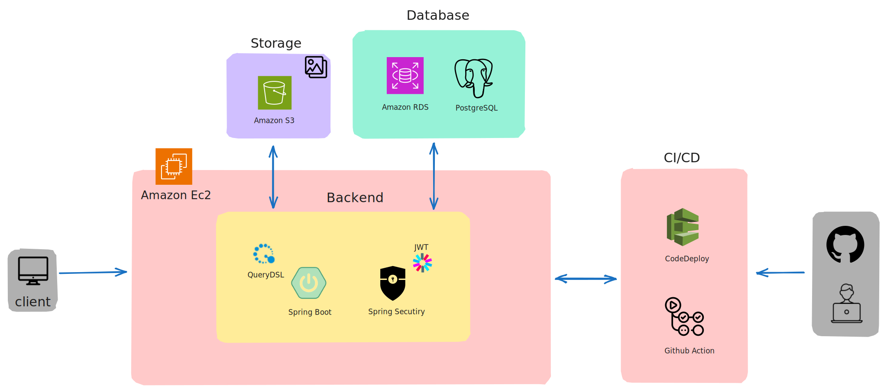
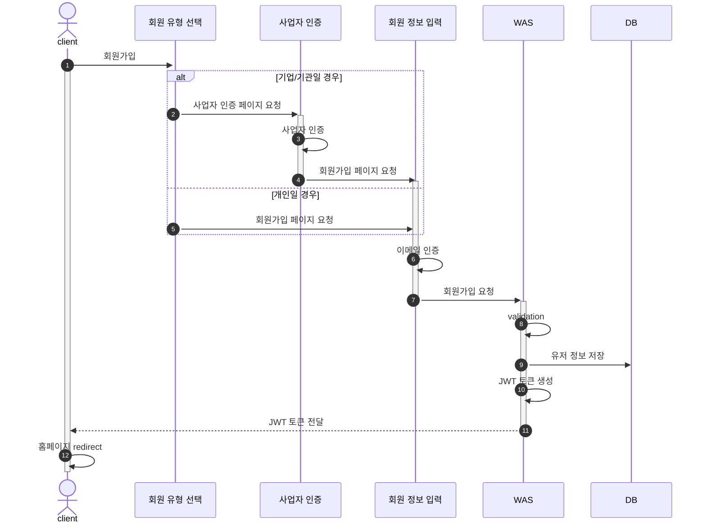
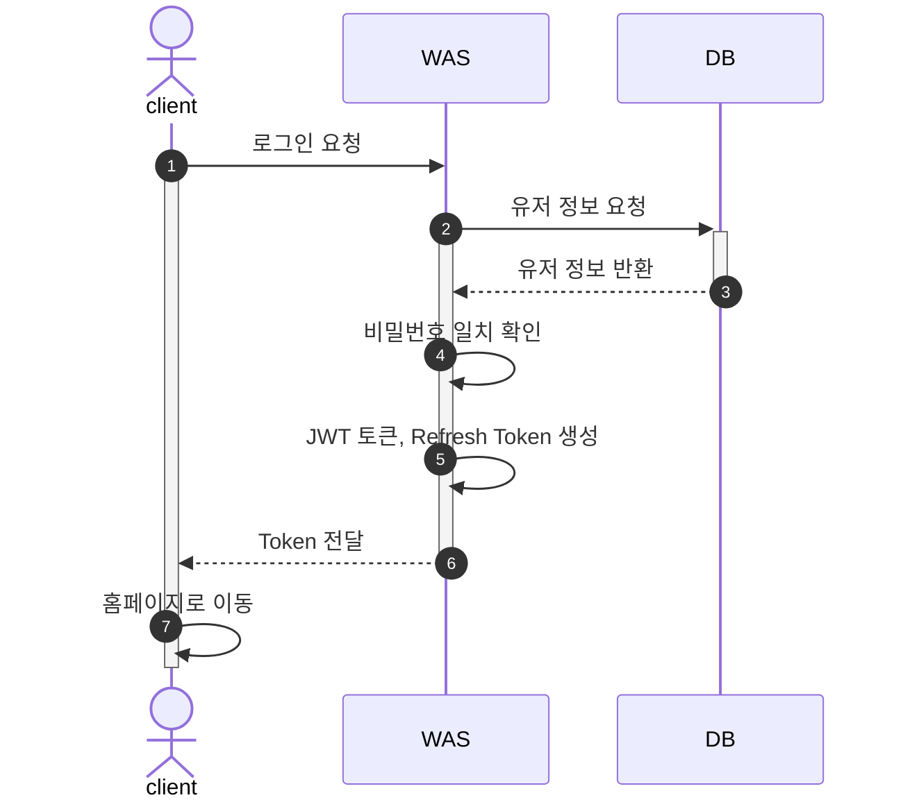
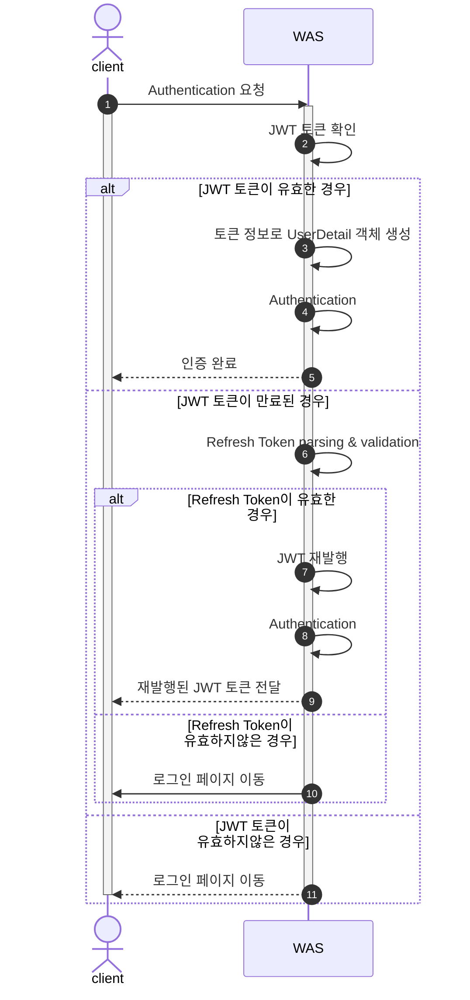
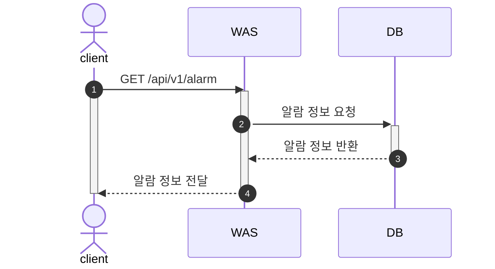
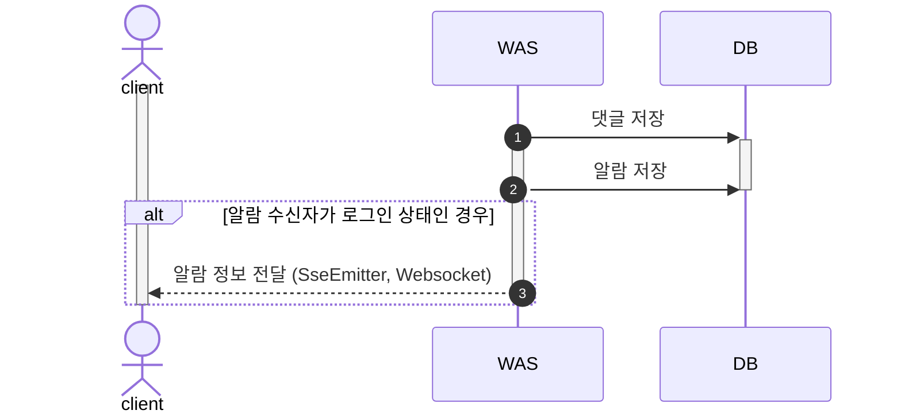
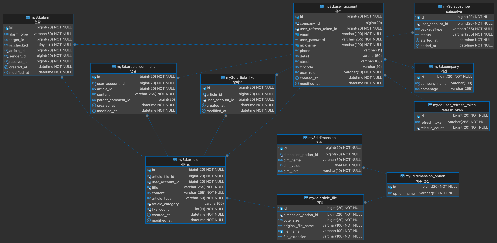

# My3D-BACKEND

- [My3D](https://github.com/JadeKim042386/My3D) BACKEND  
- 3D 모델을 공유하여 다운로드받을 수 있는 게시판 서비스
- Supported 3D Model Extension: *.stl, *.stp

## Development Environment

- Intellij IDEA Ultimate
- Java 17
- Gradle 8.5
- Spring Boot 2.7.18

## Project Structure

## AWS Structure

## Tech Stack

| BackEnd                                                                                                                                                                                                                                                                                                                                                                                                                                                                                                                                                                                                 |
|---------------------------------------------------------------------------------------------------------------------------------------------------------------------------------------------------------------------------------------------------------------------------------------------------------------------------------------------------------------------------------------------------------------------------------------------------------------------------------------------------------------------------------------------------------------------------------------------------------|
|   |
|   |
|  |

| DevOps                                                                                                       |
|--------------------------------------------------------------------------------------------------------------|
|  |
|     |

## Features

- [X] 로그인/회원가입
  - [X] 비밀번호 찾기
  - [X] 이메일 인증
- [X] 게시글 작성/수정/삭제
- [X] 게시글에 첨부된 파일 다운로드
- [X] 댓글 & 대댓글 추가/삭제
- [X] 좋아요 추가/삭제
- [X] 좋아요, 작성일자 정렬
- [X] 제목 검색
- [X] 댓글 추가시 알람 전송
- [X] 유저 정보 수정
- [X] 회원 탈퇴
- [X] 구독 기능

📝 [요구사항](./docs/requirements.md)

## Flow Chart

1. [회원가입](#1-회원가입)
2. [로그인](#2-로그인)
3. [Authentication (인증)](#3-authentication-인증)
4. [알람](#4-알람)

### 1. 회원가입

### 2. 로그인

### 3. Authentication (인증)

### 4. 알람

#### 4.1. 페이지 전환

#### 4.2. 이벤트 발생 (댓글 작성)

## ERD

- 이미지를 클릭하면 ERDCloud 페이지로 이동합니다.

