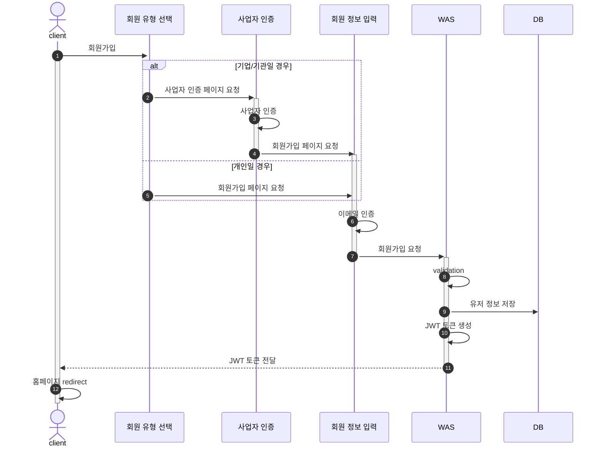
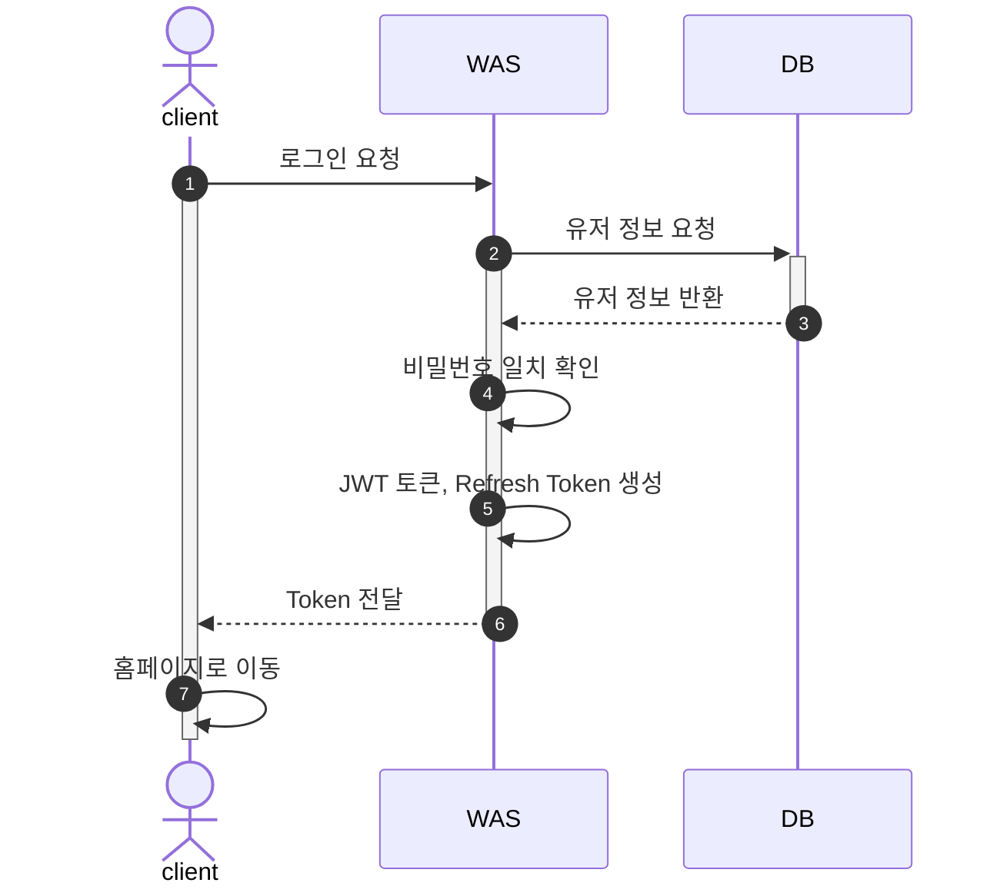
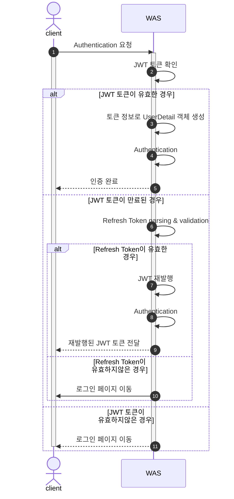

# My3D-BACKEND

[My3D](https://github.com/JadeKim042386/My3D) Backend

## Development Environment

- Intellij IDEA Ultimate
- Java 17
- Gradle 8.5
- Spring Boot 2.7.18

## Features

- [ ] 회원가입
- [ ] 로그인
- [ ] 게시글 작성/수정/삭제
- [ ] 댓글 작성/삭제
  - [ ] 대댓글 작성/삭제
- [ ] 게시글에 대한 좋아요 추가/삭제
- [ ] 댓글 추가시 알람 전송
- [ ] 유저 정보 수정
- [ ] 구독 기능

## Flow Chart

1. [회원가입](#1-회원가입)
2. [로그인](#2-로그인)
3. [Authentication (인증)](#3-authentication-인증)

### 1. 회원가입

### 2. 로그인

### 3. Authentication (인증)

## ERD

- [ERD](./imgs/my3d-erd.png)